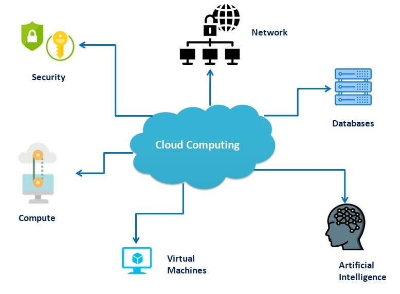
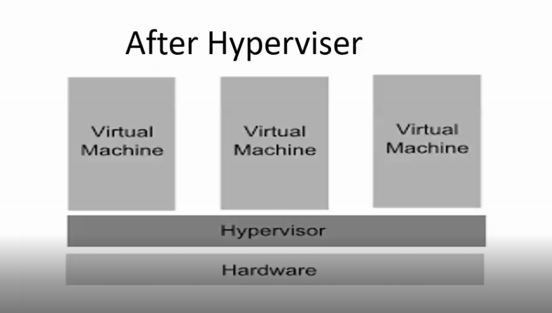
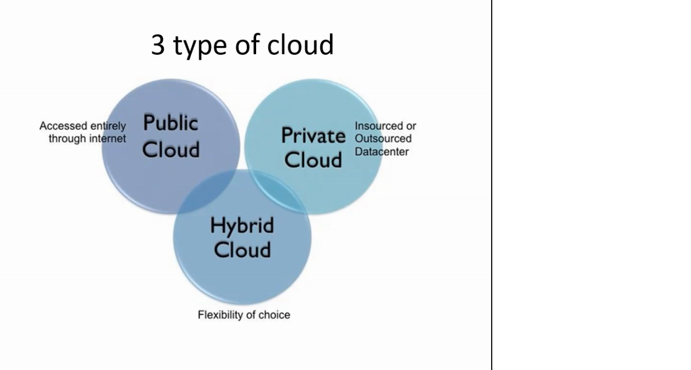

# Cloud Basics

### What is Cloud?

> **Cloud** refers to servers that are accessed over the Internet, and the software and databases that run on those servers.

### What is Cloud Computing?
> Cloud computing is the delivery of computing services—including servers, storage, databases, networking, software etc over the Internet to offer flexible & economic resources that ensure high availability.

In it's simplest form, cloud computing provides an easy way to access servers, storage databases, and a broad set of application services over the internet. 
Cloud computing providers such as AWS own and maintain the network-connected hardware required for those application services, while you provision and use what you need for your workloads.
 

### Why Cloud Computing?

Many businesses large and small use cloud computing today either directly  (e.g. Google or Amazon) or indirectly (e.g. Twitter) instead of traditional on-site alternatives.

Instead of setting up huge servers, databases etc across the globe, Cloud services are being used. Cloud offers these advantages:

- Reduction of costs

- Universal access

- Up to date software

- Choice of applications.

- Potential to be greener and more economical

- Flexibility

### Benifit of using Cloud Services

- **Faster Deployments:** Because there’s no wait for local computing resources

- **Usage-based pricing:** letting you pay only for what you us

- **Less financial risk:** with lower up-front investment in hardware and software

- **Easier upgrades:** with no on-premises software to update

- **Reduced need for on-premises resources:** such as servers and IT staff

Cloud computing enables a user to focus on their projects and customers, without worrying about infrastructure concerns. It not only saves time, money, and effort but also allows users to concentrate on the differentiating aspects of their business.

### Disadvantages of Cloud Computing

- **Security Issues:** Secuity is the major issue in cloud computing. The cloud  services implement the best security standards and industry  certifications. however storing data on external service providers always  bears a risk.
  
- **Technical Issues:** You always need to rely on the internet like  uploading/downloading and migrating.

### Understanding differences between On-premises and Cloud architecture

You might have heard the term **Data Center** as every organisation needs it, small or big according to their need.

However, there is a difference in the traditional data centers and the latest ones.

**what are Data Centres?**

> A data center is a facility that provides shared access to applications and data using a complex network, compute, and storage infrastructure. It consists of Servers, Databases, Network infrastructure etc.

This is how a traditional data center looks like.

Referring to the above diagram of traditional Data center, you will be having physical Hardware and it may be of IBM, HP, DELL or any other vendor.

Then you will install OS on these Hardware that may be Windows or Linux.

Then you install application(s) on these OS which could be email server(s), web server(s), production or non-production servers etc. As a solution architect, your job is to make these applications **Highly Available**. We often use the term **HA** or **High Availability**, which means the application should have negligible downtime.

For HA, we are keeping another identical Hardware and installed same OS and Application. And then we were create a cluster.

**What is Cluster?**
> It is a group of two or more then two hardwares. If one Hardware fails, then another one takeover and application do not see downtime.

 so like this we manages the HA before 10-15 years back. But Here we face some challeges that we were not able to do effective utalization of resources "like in our case we manages two hardware as cluster but here if first hardware is not failed then the 2nd one is always unutalized" 
Highcost:  cost of project will be double if you using two Hardware for a single application 
Managebility was tough if suppose you need 50 servers after using Cluster using 100 servers that needed more space more power consumption more cooling more man power to manage these resources so earlier we faces these challeges in traditional datacentres.

### Disadvantages of traditional Data Centre:- 
  System resources were under utalized :- if suppose first H/W is not failed then second one is under utalized
  Difficult to Manage :- 
  Some times Electricity bill of Data Center was more than the cost of infra :- infra is always having a depreciation cost Every year its 20% less every year after 5 the infra will not be having any significant cost 

### When we were having these challanges 3 companies started working on these challenges they started working on the concept of Virtualization
  Microsoft 
  VM Ware
  Xen

### They created a software and the name of the software is hypervisor and hypervisor is a softwae which initiate or starts the virtalization
  When Hypervisor came in market so companies launched there own hypervisor there own name
  Hyperviser Flavours
  Microsoft - HyperV
  Redhat - Xen - KVM 
  Citrix - Xen 
  VMWare - ESX- ESXI (Elastic Sky X Intigrated)

### After HiperViser (PiC)

  These hyperviser created all Traditional data centers to virtualdatacenter 
  so after solved these traditional Datacenters Challenges we also having challanges in Virtual Datacenters and one of the biggest challenge is that, these days
  the kind of application which we are having the companies they are maintaining monitoring deploying these application into different different regions around
  the worlds
  Ex
  Integrating these virtualdatacenter with a webinterface using Rest APIs(using to control infra) these platform known as cloud platform with these we can manage cloud

### Three types of cloud 
Public 
Private 
Hybride

### Private Cloud

It is Single Tenant
IBM - Softlayer
Fixed Capacity

### Disadvantage
Agility :- How easily you get things
Elasticity :- How Many you get things

### Public Cloud

Multi Tenant :- Multipal organization can use this cloud in different different model
SAAS (Software as a service) :- you are going to use a perticular software as a service (Dropbox,office365 you can access your data from anywhere with any device)
PAAS (Plateform as a service) :- if you are a developer then you need a platform it may be java,.net etc so you can use it over a cloud without any upfront cost and commitment pay what you use without creating infrastructure and you dont care about the infra its take care by amazone only
IAAS (Infrastructure as a Service) :- Here you create your infrastucture without paying the upfront cost you  can deploy your own application on servers you will according to usage and Even dont need of upront Commitment and SAAS and PAAS both are part of IAAS 
In the Market there are So many big players those are providing Cloud Services
Aws 40%
Azure 25%
Google 14%
Alibaba
Oracle
Rackspace

Features

Cost effective
Elasticity
PPU pay per use
Secuity
Telemetry :- Monitoring the Customer usage and generating the bill

Hybride Cloud 

Both private and Public 

### Introduction to AWS

In 2006 some Engineers of Aws Suggested to Management that the Access Capacity of resources we have we should have to start selling the Access Capacity of resources
They started selling the capacity (CPU, RAM, Storage) Storage is always ondemand in every datacenter 
2003 – Chris Pinkman & Benjamin Black present a paper on what Amazon’s own internal infrastructure should look like.
History
•Suggested selling it as a service and prepared a business case.
•SQS officially launched in 2004
•AWS Officially launched in 2006
•2007 over 180,000 developers on the platform
•2010 all of amazon.com moved over
•2012 First Re-Invent Conference
•2013 Certifications Launched

###Understanding AWS Regions & Availability Zones.
Amazon EC2 is hosted in multiple locations world-wide. These locations are composed of regions and Availability Zones. Each region is a separate geographic area.
Each region has multiple, isolated locations known as Availability Zones. Amazon EC2 provides you the ability to place resources, such as instances, and data in multiple locations. Resources aren't replicated across regions unless you do so specifically.
Each region is completely independent. Each Availability Zone is isolated, but the Availability Zones in a region are connected through low-latency links.
The following diagram illustrates the relationship between regions and Availability Zones.

Regions :- Location 
Mumbai, Sydney, Virginia now 31 regions service is now available
Here so many of Data Centers created by Amazone 
Mumbai :- DC1, DC2, DC3
Sydney :- 3DC
Virginia :- 6DC
region behind to creating more then one Datacenters HA they are Isolated with seperate powersupply seperate internet connectivity but connected 
with each other using very very high speed private fiber channel 
If you Deployed an application in DC1 and DC2 and if DC1 is got failed by chance so Amazone will be able to provide you the environment of HA and these DC is Known as 
Avalability Zones 99 AZ overall in all regions
 
Edge Locations :- These edge Locations will be used to provide low latency access to the end customers.
Aws Provide small small Datacenters

How to Make Account

If you want to start working with AWS you need to create Aws Account on aws.amazone.com/free 
for learning perpose you will create free Account and use services, almost all services are free for limited time

  

